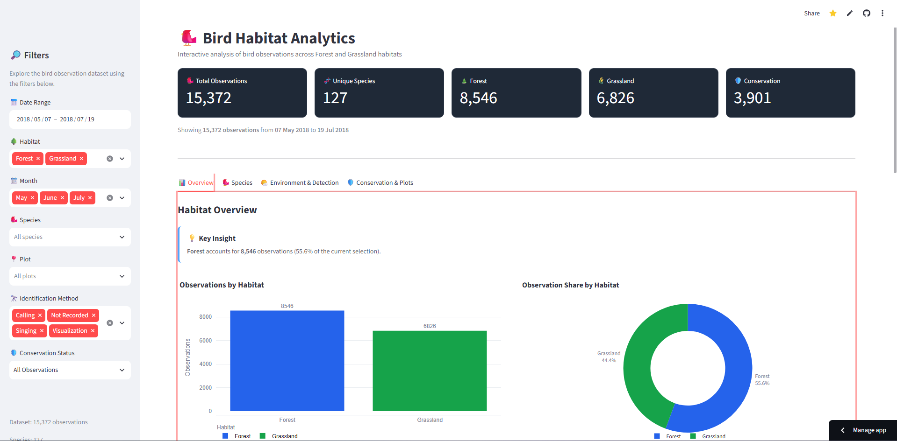

# 🐦 Bird Species Observation Analysis

## 📊 Project Overview

This project analyzes bird observation data collected across **Forest** and **Grassland** habitats to understand species distribution, habitat activity, observation patterns, environmental conditions, detection methods, survey effort, and conservation significance.

The analysis transforms raw multi-sheet monitoring data into a cleaned and analysis-ready dataset, performs exploratory and comparative analysis, stores the processed data in a **SQLite database**, and presents the results through an interactive **Streamlit dashboard**.

The project is designed from an analytical and conservation perspective, focusing on questions such as:

- Where are bird observations most concentrated?
- Which species are most frequently observed?
- How does bird activity change over time?
- How does observation activity differ between Forest and Grassland?
- Which plots show the highest observation activity?
- What environmental conditions are associated with observations?
- How are birds identified and recorded?
- Which observations have conservation significance?

---

## 🎯 Analytical Problem

Bird-monitoring datasets contain valuable information about biodiversity and habitat usage, but raw observational records require integration, cleaning, validation, and structured analysis before meaningful insights can be derived.

This project focuses on five key areas:

1. **Habitat Activity** – Analyze observation volume, plot activity, and species richness across Forest and Grassland.
2. **Species Distribution** – Identify frequently observed, shared, and habitat-specific species.
3. **Temporal & Environmental Patterns** – Examine observation timing, temperature, humidity, weather, and disturbance.
4. **Observation & Survey Context** – Analyze identification methods, distance, flyovers, observers, visits, and survey effort.
5. **Conservation Insights** – Identify observations and species associated with PIF Watchlist and Regional Stewardship status.

---

## 🛠️ Tools & Technologies

- **Python**
- **Pandas**
- **NumPy**
- **Jupyter Notebook**
- **SQLite**
- **Streamlit**
- **Plotly**
- **GitHub**
- **Data Visualization**
- **Exploratory Data Analysis**

---

## 📁 Project Files

| File / Folder | Description |
|---|---|
| `app.py` | Interactive Streamlit dashboard application |
| `data/bird_observations_clean.csv` | Cleaned and analysis-ready bird observation dataset |
| `database/bird_observations.db` | SQLite database containing the processed observation data |
| `requirements.txt` | Python dependencies required to run the dashboard |
| `.devcontainer/devcontainer.json` | Development container configuration |
| `.gitignore` | Files and folders excluded from version control |

---
# 📁 Project Structure

```text
Bird-Species-Observation-Analysis/
│
├── .devcontainer/
│   └── devcontainer.json
│
├── data/
│   └── bird_observations_clean.csv
│
├── database/
│   └── bird_observations.db
│
├── Bird-Species-Analysis-Dashboard-Snapshot.png
├── BIRD SPECIES OBSERVATION ANALYSIS.pdf
├── app.py
├── requirements.txt
└── .gitignore
```
## 🔄 Data Analytics Workflow

**Raw Data → Data Integration → Data Cleaning & Preprocessing → Data Quality Validation → Exploratory Data Analysis → Habitat Comparison → Temporal Analysis → Spatial Analysis → Species Analysis → Environmental Analysis → Observer & Visit Context → Distance & Behavior → Conservation Analysis → Key Findings → Dashboard**

---

# 🧹 Data Preparation

## Data Integration

- Consolidated observation sheets from the Forest and Grassland datasets.
- Added a `Habitat` field to distinguish Forest and Grassland observations.
- Combined the habitat datasets into a single analytical dataframe.
- Validated column structures before integration.

## Data Cleaning & Preprocessing

The dataset was prepared for analysis by:

- Converting `Year` and `Visit` into appropriate numeric formats.
- Converting `Start_Time` and `End_Time` into datetime formats.
- Standardizing missing categorical values.
- Replacing missing `ID_Method`, `Distance`, and `Sex` values with `Not Recorded`.
- Checking and removing exact duplicate records.
- Creating derived temporal fields such as:
  - `Observation_Hour`
  - `Time_Period`
  - `Month_Number`
  - `Month_Name`

## Data Quality Validation

Data quality was validated through:

- Missing-value analysis
- `Not Recorded` value checks
- Duplicate verification
- Key-field completeness checks
- Categorical and numerical field validation

---

# 📈 Exploratory & Comparative Analysis

## Habitat Comparison

Analyzed:

- Total observation volume
- Unique species richness
- Shared and habitat-specific species
- Observations per plot
- High-activity plots

## Temporal Analysis

Analyzed:

- Monthly observation trends
- Observation distribution by month
- Observation activity by hour
- Peak observation hour
- Broader observation time periods

## Spatial Analysis

Analyzed:

- Observation activity by `Plot_Name`
- Number of plots by habitat
- Mean, median, and maximum observations per plot
- Survey sessions by plot
- Observations per survey session
- Highest-activity plots

## Species Analysis

Analyzed:

- Species observation frequency
- Species distribution across habitats
- Species contribution within habitats
- Habitat-specific species
- `Scientific_Name` and `Common_Name` consistency
- Sex distribution

## Environmental Analysis

Analyzed:

- Temperature
- Temperature bands
- Humidity
- Sky conditions
- Wind conditions
- Disturbance levels

## Observer & Visit Context

Analyzed survey effort using:

- `Observer`
- `Date`
- `Plot_Name`
- `Visit`
- `Habitat`

Survey sessions and observation volumes were summarized to provide context for recorded observations.

## Distance & Behavior

Analyzed:

- Observation distance
- Identification methods
- Flyover observations
- Sex categories

## Conservation Analysis

Analyzed:

- PIF Watchlist observations
- Regional Stewardship observations
- Conservation-status species
- Observation frequency of conservation-status species
- Conservation-status observations across habitats

---

# 📌 Key Findings

- **Forest recorded more observations overall:** 8,546 observations compared with 6,826 in Grassland.
- **Grassland showed higher plot-level activity:** 33.96 observations per plot versus 20.95 in Forest.
- Species richness was nearly identical: **108 Forest species vs. 107 Grassland species**, with **88 species shared**.
- **June was the peak month for Forest**, while Grassland observations were more evenly distributed across May–July.
- **7 AM was the peak observation hour** in both habitats.
- Most observations occurred within the **20–25°C** temperature band.
- **Singing** was the dominant identification method in both habitats.
- Grassland had substantially higher proportions of **visual identifications and flyover observations**.
- Forest had a considerably higher share of **PIF Watchlist observations** and **Regional Stewardship observations**.
- The highest-activity plot was **ANTI-0163 (Grassland)** with **54 observations**.

### Overall Insight

**Forest contributed more observations and showed greater conservation-status representation, while Grassland showed higher observation activity per plot and more visual and flyover observations.**

---

# 📊 Interactive Dashboard

The project includes an interactive **Streamlit dashboard** for exploring bird observations across Forest and Grassland habitats.

The dashboard provides visual analysis of:

- Habitat activity
- Species observations
- Monthly and hourly trends
- Plot-level activity
- Environmental conditions
- Identification methods
- Observation distance
- Flyover observations
- Conservation indicators

### Dashboard Preview



### 🚀 Live Dashboard

**[View the Streamlit Dashboard](https://bird-species-observation-analysis-kartikey-singh.streamlit.app/)**

---

# 🗄️ SQLite Database

The cleaned bird observation dataset is stored in a **SQLite database** and used as the primary data source for the Streamlit dashboard.

The dashboard connects to:

```text
database/bird_observations.db

The database is included in:


database/bird_observations.db
```
# ⚠️ Data Limitations

The analysis is based on **recorded bird observations**, which reflect both bird activity and survey effort.

Therefore:

- Higher observation counts do not necessarily represent larger bird populations.
- Forest and Grassland contain different numbers of plots, affecting total observation volume.
- Differences in identification methods and observation distance can influence recorded observations.
- Environmental findings represent observed patterns and associations rather than causal relationships.
- Survey effort should be considered when interpreting habitat-level differences.

---

# 🎯 Project Outcome

This project transformed raw bird-monitoring records into an end-to-end analytical solution:

**Raw Observation Data → Data Integration → Data Cleaning → Data Validation → Exploratory Analysis → SQLite Database → Interactive Streamlit Dashboard → Key Findings**

The project demonstrates how Python-based data analysis can transform complex environmental observation records into **clear, interactive, and decision-oriented insights** for biodiversity, habitat monitoring, and conservation analysis.

---

## 👤 Author

**Kartikey Singh**

**Data Analyst | Power BI | Python | SQL | Excel**

LinkedIn: *[Kartikey_Singh](https://www.linkedin.com/in/btwitskartiksinghdatanalyst/)*

GitHub: *[Kartikey_Singh](https://github.com/T3MP35TT)*

Portfolio : *[Kartikey_Singh]([https://github.com/T3MP35TT](https://sites.google.com/view/kartikeysingh09/home))*

Complete WriteUp: *[Kartikey_Singh](https://medium.com/@kartikey.singh09/i-thought-i-was-analyzing-bird-data-i-ended-up-learning-a-lot-about-data-storytelling-7ad160e12a0c?postPublishedType=initial)*
